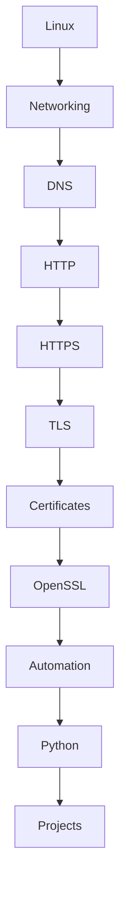

# Learning Path

```mermaid
flowchart TD

Linux --> Networking

Networking --> DNS

DNS --> HTTP

HTTP --> HTTPS

HTTPS --> TLS

TLS --> Certificates

Certificates --> OpenSSL

OpenSSL --> Automation

Automation --> Python

Python --> Projects
```

## Goal

Understand how secure communication works from the network layer to application security through practical documentation and labs.
