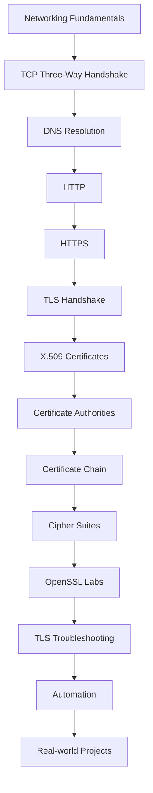
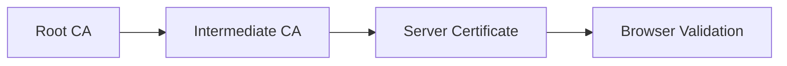
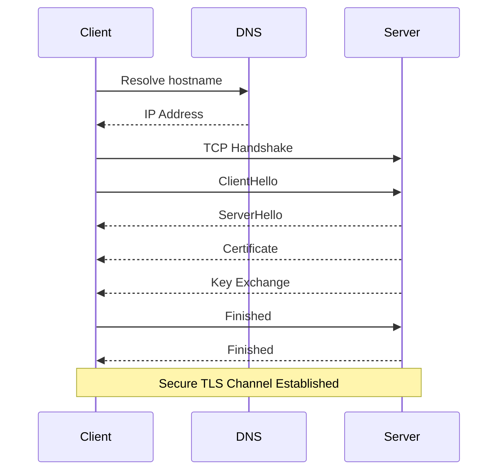

<div align="center">

# 🔐 TLS Engineering Handbook

### Understanding Transport Layer Security Through Hands-on Labs


A practical engineering handbook for learning **TLS, HTTPS, X.509 Certificates, OpenSSL, Certificate Chains, Cipher Suites, and Secure Communication** through documentation and hands-on labs.

</div>

---

# 📖 Overview

This repository documents my journey of learning **Transport Layer Security (TLS)** from an engineering perspective.

The goal is to understand **how secure communication works**, how certificates are validated, and how to inspect TLS connections using standard tools such as **OpenSSL**. Examples are provided for educational purposes using systems that I own or publicly available demonstration services.

---

# 🎯 Learning Objectives

- Understand the TLS protocol
- Learn how HTTPS establishes secure connections
- Read and inspect X.509 certificates
- Understand Certificate Authorities (CA)
- Learn Certificate Chains
- Explore Subject Alternative Names (SAN)
- Understand Cipher Suites
- Practice with OpenSSL
- Troubleshoot common TLS issues
- Document every lab with reproducible steps

---

# 🗺 Learning Roadmap



---

# 📂 Repository Structure

```text
.
├── README.md
├── LICENSE
├── docs/
│
├── 01-networking/
├── 02-http/
├── 03-https/
├── 04-tls/
├── 05-openssl/
├── 06-certificates/
├── 07-certificate-chain/
├── 08-san/
├── 09-cipher-suites/
├── 10-troubleshooting/
├── labs/
├── cheatsheets/
├── scripts/
└── assets/
```

---

# 📚 Documentation

## 01 Networking

- TCP
- UDP
- Ports
- DNS
- Routing

---

## 02 HTTP

- Request
- Response
- Headers
- Status Codes

---

## 03 HTTPS

- Why HTTPS
- Secure Communication
- Encryption
- Authentication

---

## 04 TLS

- TLS History
- TLS Versions
- TLS 1.2 vs TLS 1.3
- TLS Handshake

---

## 05 OpenSSL

Common commands:

```bash
openssl version

openssl s_client

openssl x509

openssl verify

openssl req

openssl rsa
```

---

## 06 X.509 Certificates

Topics:

- Subject
- Issuer
- Validity
- Public Key
- Signature
- Extensions
- SAN

---

## 07 Certificate Chain



---

## 08 Subject Alternative Name (SAN)

Learn how certificates identify multiple DNS names using the Subject Alternative Name extension.

---

## 09 Cipher Suites

Example:

```
TLS_AES_256_GCM_SHA384
```

Breakdown:

- TLS
- AES-256
- GCM
- SHA-384

---

## 10 Troubleshooting

Common scenarios:

- Handshake failure
- Certificate expired
- Unknown CA
- Hostname mismatch
- SNI issues
- Protocol mismatch

---

# 🧪 Hands-on Labs

Each lab includes:

- Objective
- Prerequisites
- Commands
- Expected Output
- Explanation
- Troubleshooting
- References

Example:

```text
Lab: Inspecting a TLS Certificate with OpenSSL

Objective
- Retrieve and inspect an X.509 certificate.
- Identify the issuer, subject, validity period, and negotiated protocol.

Prerequisites
- OpenSSL
- Linux or WSL

Commands
- openssl s_client ...
- openssl x509 ...

Key Observations
- TLS version
- Cipher suite
- Subject
- Issuer
- Validity period

What I Learned
- How certificate validation works.
- Why SNI matters.
- How to read certificate fields.
```

---

# 🔄 TLS Connection Flow



---

# 📈 Progress

- [ ] Networking Fundamentals
- [ ] HTTP
- [ ] HTTPS
- [ ] TLS Basics
- [ ] TLS 1.3
- [ ] OpenSSL
- [ ] X.509 Certificates
- [ ] Certificate Chains
- [ ] Subject Alternative Name
- [ ] Cipher Suites
- [ ] TLS Troubleshooting
- [ ] Automation

---

# 📚 References

- OpenSSL Documentation
- RFC 8446 (TLS 1.3)
- RFC 5280 (X.509 PKI)
- Mozilla SSL Configuration Guidelines
- OWASP Transport Layer Protection Cheat Sheet

---

# 📄 License

This project is licensed under the MIT License.

---

<div align="center">

**Learn • Document • Practice • Improve**

Made with ❤️ by **Kongali1720**


<div align="center">


# 🌍 Digital Ecosystem


<table align="center">


<tr>
<th>Project</th>
<th>Status</th>
<th>Technology</th>
</tr>


<tr>
<td>
<a href="https://kongalicoin.id">
KongaliCoin ID
</a>
</td>

<td>🟢 Active</td>
<td>Ethereum Web3</td>

</tr>


<tr>
<td>
<a href="https://kongalicoin.com">
KongaliCoin COM
</a>
</td>

<td>🟢 Active</td>
<td>Smart Contract</td>

</tr>


<tr>
<td>
<a href="https://younext.cloud">
YOUNEXT Cloud
</a>
</td>

<td>🟢 Active</td>
<td>Cloud Security</td>

</tr>


<tr>
<td>
<a href="https://zlclothindustries.com">
ZLCLOTH Industries
</a>
</td>

<td>🟢 Active</td>
<td>Enterprise System</td>

</tr>


</table>


</div>


---

<div align="center">


<div align="center">


# 🤝 Collaboration


Open Collaboration:


🛡 Cyber Defense Research

🔐 Security Engineering

☁ Cloud Architecture

⛓ Blockchain Security

🚀 Open Source


⚠️ Research dilakukan secara legal dan mengikuti etika profesional.


</div>


---

<div align="center">


# ☕ Support Development


Jika project ini membantu kamu,
support kecil sangat berarti.


<a href="https://www.paypal.com/paypalme/bungtempong99/">


</a>


</div>


---

<div align="center">


# 💛 Human Mode


```text
"Mereka tidak berbeda.

Mereka mengajarkan arti cinta,
ketulusan dan kesabaran."
```


</div>


---

<div align="center">


# 🇮🇩 Gaspol Coding Squad Indonesia


> "Run it, understand it."


Focus:


🐍 Python Project

🛡 Security Tools

⚙ Automation

🏴 CTF Training

🔐 Secure Coding


</div>


---

<div align="center">


⭐ **Think Secure • Build Resilient • Protect Future** ⭐


</div>

<div align="center">
</div>
